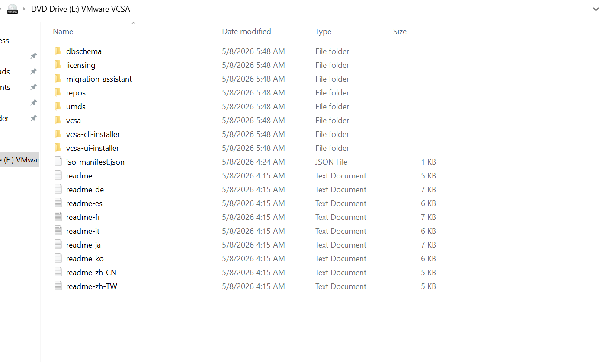
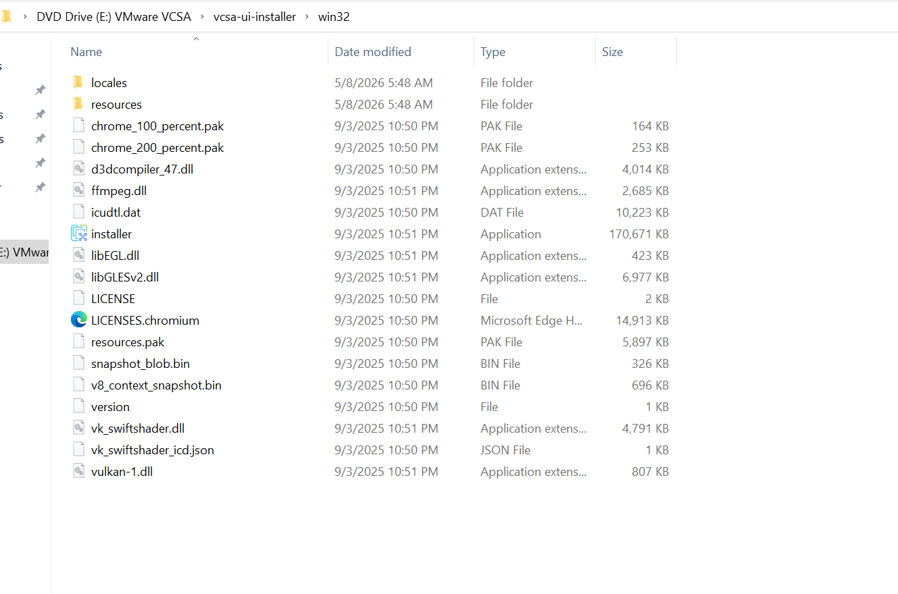

# deploy-vcenter-server 8.x/7.x

vCenter Server is the central management platform for VMware vSphere environments. It lets you control ESXi hosts, virtual machines, storage, networking, automation, and security — all from one place.

There are two Stage for deploy vCenter server applicance. 
## Stage 1

**Prerequsit: For Deploy vCenter server 8.x/7.x you must have a DNS server or your IP address must be resolve the FQDN and from the installer machine IP address must be resolve the FQDN**

- Download the target vCener ISO from VMware 

- Mount the ISO file or extract the ISO. 

- After mount the ISO it look like this:

  

- From the mount directory go the vcsa-ui-installer> win32 and click on intaller application

  

